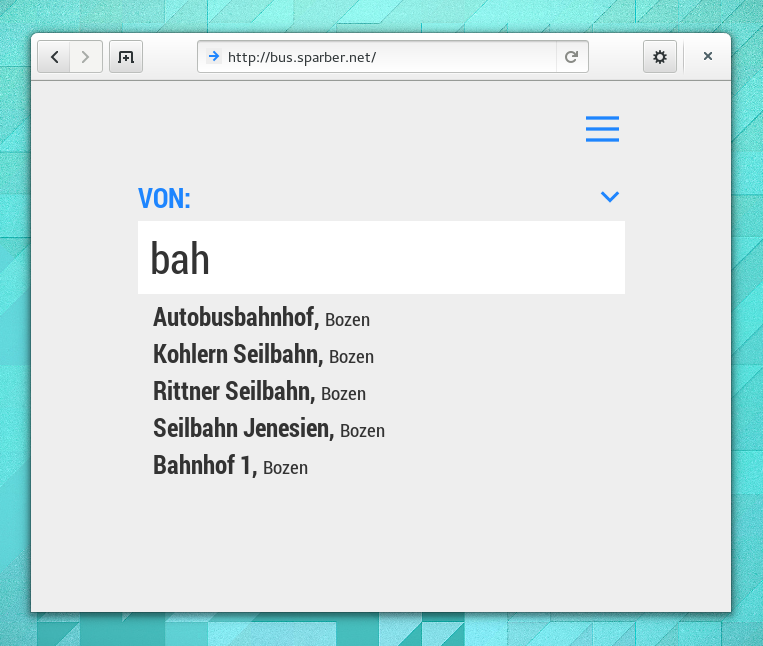
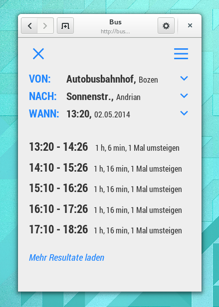

bus
===

A simple bus routing web app using the [sasabus.org](http://sasabus.org) API. You can try it [here](http://bus.sparber.net).

Works for all SASA bus connections in South Tyrol (i.e. city buses in the areas around Merano and Bolzano). This app is a faster, simpler alternative to the routing component of the [official SASA web app](http://html5.sasabus.org).

##Current Status
The app works well most of the time in most browsers, but we haven't done a lot of testing yet so there might still be some issues we don't know about. If you encounter any bugs, please [file an issue](https://github.com/realnumbers/bus/issues).

##Screenshots

##FAQ

####Why are the search results so slow to load?
Unfortunately, that's the API's fault and there's nothing we can do about it.

####The bus stop strings are full of mistakes.
We know, but these are the strings that we get from the API, so it's not really in our control.

####Why doesn't it work without Javascript?
We'd love to be able to provide a version of the app that works without Javascript. Unfortunately that isn't possible without rewriting the app in a server side language, which we don't plan on doing anytime soon.

####The app does not work in my browser!
Please [file an issue here](https://github.com/realnumbers/bus/issues).

##Copyright
Designed and developed by [Tobias Bernard](http://tobiasbernard.com) and [Julian Sparber](http://julian.sparber.net). Released under the terms of the GNU Affero General Public License version 3 or later.
